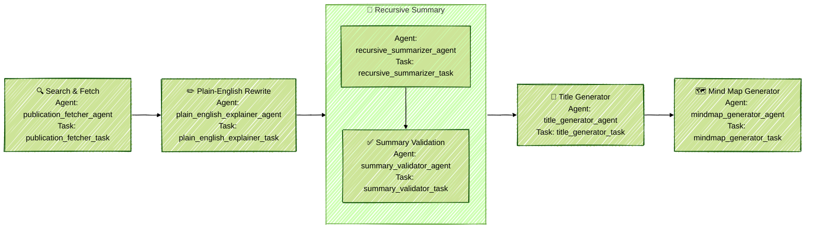

# 🧬 BioMedSimplify

**BioMedSimplify** is an LLM-powered agentic workflow designed to **automate and simplify biomedical literature analysis**. It extracts, rewrites, summarizes, and visualizes insights from the latest publications on a given biomedical topic—generating a researcher-friendly Markdown report complete with citations and a visual mind map.

---

## 🌟 Features

✅ Search recent biomedical publications from NCBI  
✅ Translate technical abstracts to **plain English**  
✅ Recursively summarize multiple papers into one **coherent summary**  
✅ Validate that every paper is cited at least once in the summary  
✅ Generate a **title** and a **MermaidJS mind map**  
✅ Output a polished **Markdown report**  
✅ Built with **Streamlit UI**  
✅ Works with **Ollama**, **OpenAI**, **Azure**, or any OpenAI-compatible LLM  

---

## 🧪 Agentic Workflow (CrewAI)



| Step | Agent | Task | Description |
|------|-------|------|-------------|
| 🔍 Search & Fetch | `publication_fetcher_agent` | `publication_fetcher_task` | Query NCBI via BioPython Entrez for latest publications |
| ✏️ Plain-English Rewrite | `plain_english_explainer_agent` | `plain_english_explainer_task` | Rewrites abstracts into simple language |
| 🧬 Recursive Summary | `recursive_summarizer_agent` | `recursive_summarizer_task` | Builds a coherent summary using simplified abstracts |
| ✅ Validation | `summary_validator_agent` | `summary_validator_task` | Ensures coherence and that all papers are cited |
| 🧠 Title Generator | `title_generator_agent` | `title_generator_task` | Suggests the best possible title |
| 🗺️ Mind Map Generator | `mindmap_generator_agent` | `mindmap_generator_task` | Generates a MermaidJS mind map of concepts |

---

## 📄 Output Structure

The output Markdown report includes:

1. **Generated Title**
2. **MermaidJS Mind Map**
3. **Summary with In-text Citations**
4. **References with Metadata**

---

## 📸 Demo


---

## 🧠 Use Cases

- **Students**: Understand research in simpler terms  
- **Researchers**: Rapid literature reviews  
- **Educators**: Turn complex papers into teachable content  
- **Funding Bodies**: Summarize research proposals quickly  
- **Knowledge Systems**: Feed structured summaries into graphs/databases  

---

## 🖥️ Running the Project

This project has been tested with python `3.10.16` connected with **Ollama** running locally with LLM `llama3.2:latest`.

### 🔧 Steps

1. Checkout the project code at;

```
https://github.com/tech-magic/biomed-simplify.git
```

Execute all steps from 2 to 5 below by traversing to the project root folder via commandline.


2. Adjust the settings inside `app_config.json` based on your local environment.

```json
{
    "entrez": {
        "email": "any_valid@email.com"
    },
    "llm": {
        "model": "llama3.2:latest",
        "openai_endpoint": "http://localhost:11434/v1",
        "openai_api_key": "dummy"
    }
}
```

For the `entrez` setting above, you can provide any valid email address (including a personal one). This is required by the `Entrez` module in the `biopython` library when connecting to the NCBI PubMed repository at https://pubmed.ncbi.nlm.nih.gov/.

For the `llm` settings, connect any LLM (ChatGPT, Azure, Ollama, vLLM) endpoint backed by OpenAI.

3. Create a new python virtual environment.
```
python3 -m venv biomed-venv

source biomed-venv/bin/activate
```

4. Install all requirements inside the python virtual environment.
```
pip3 install -r requirements.txt
```

5. Run the project with;
```
streamlit run app.py
```
You should be able to access the running project at `http://localhost:8501` (see the `Demo` section in this README)